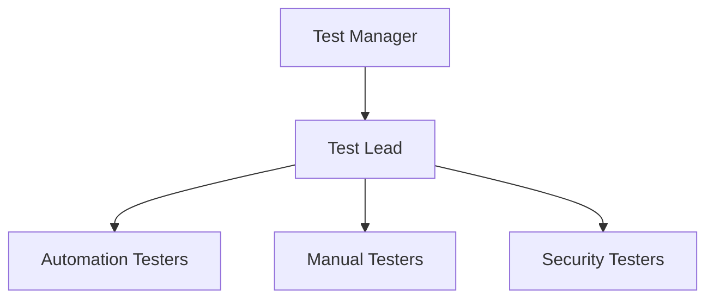

# Master Test Plan: Retail Banking Application 🏦

## 📋 Table of Contents
- [1. Management Summary](#1-management-summary)
- [2. Quality and Test Objectives](#2-quality-and-test-objectives)
- [3. Requirements Strategy](#3-requirements-strategy)
- [4. Test Scope](#4-test-scope)
- [5. Test Strategy](#5-test-strategy)
- [6. Test Organization and Human Resources](#6-test-organization-and-human-resources)
- [7. Test Environment](#7-test-environment)
- [8. Schedule](#8-schedule)
- [9. Test Management](#9-test-management)
- [10. Risk Management](#10-risk-management)

## 1. Management Summary
<details>
<summary>Click to expand</summary>

This document outlines the comprehensive test plan for our retail banking application. It serves as the primary reference for all testing activities throughout the project lifecycle.

### 1.1 Goals of the Master Test Plan

The primary goal of this Master Test Plan is to outline a comprehensive and structured approach to the testing of the retail banking application, to determine if the application meets all the business and technical requirements. This plan serves as a guide to align testing activities with the overall project objectives, aiming to achieve the following:

- **Validate Quality**: Validate that the retail banking application performs as expected across multiple channels, including online platforms, physical branches, ATMs, and in-person interactions.

- **Risk Mitigation**: Identify and address potential risks and defects early in our software development lifecycle to prevent post-release issues.

- **Regulatory Compliance**: Test that the application conforms to the banking regulations and security standards, such as PCI-DSS and GDPR as applicable, in order to protect the customer data and maintain transactions' integrity.

### 1.2 Summary of the Test Strategy

The test strategy for the retail banking application is a multi-pronged test approach:

- **Test Levels**: Testing will be conducted at the test levels, including Unit Testing, Integration Testing, System Testing, and User Acceptance Testing (UAT). In each test level, the focus will be different, in order to gauge application quality from different points of view.

- **Types of Testing**: The types of testing will include functional testing for core banking operations, performance testing to assess system scalability, security testing to test safety of the sensitive data, and usability testing to test the customer experience.

- **Test Automation Strategy**: Test automation will be used to increase repeatability and efficiency. Automated tests scripts will be developed for smoke testing, high-priority functional test scenarios and regression testing.

- **Defect Management**: A systematic defect management process will be followed to track and resolve issues. This includes categorizing defects by severity, prioritizing them based on impact, regular tracking for their timely resolution and retesting on resolution.

- **Test Environment and Data Strategy**: A controlled and consistent test environment will be established to replicate the production environment (as closely as feasible). Test data will be stored securely in a centralized repository, with anonymized and representative data sets available for test execution.

### 1.3 Purpose of the Document

This document serves as a detailed guide for the testing of the retail banking application. It provides a structured template, that is reusable in similar projects. It aims to:

- **Provide Clarity**: Give a clear understanding of the testing objectives, scope, and strategies to all stakeholders, including the client, project managers, business analysts, developers, and testers.

- **Increase Coordination**: Establish a common testing methodology and test approach to coordinate efforts within the testing team, and with the developers and other stakeholders.

- **Create Consistency**: Create a consistent test approach that can be adapted for future projects, encouraging the reuse of test assets and alignment with organizational testing standards.

- **Support Decision-Making**: Serve as a reference for decision-making throughout the software testing lifecycle, providing guidelines regarding test process management (for example managing the test progress, risk areas, and quality metrics).

</details>

## 2. Quality and Test Objectives
<details>
<summary>Click to expand</summary>

### 2.1 Overall Testing Goals

- **Verify Functionality**: Test if all the features and functionalities of the retail banking application meet the specified business requirements and give expected results across all user interfaces, including online banking, ATM interactions, and in-branch services.

- **Validate System Integration**: Confirm if all integrated systems, including third-party services (e.g. payment gateways, credit scoring systems), work correctly with the banking application.

- **Test Security and Compliance**: Verify that the application conforms to the banking regulations and security standards, such as PCI-DSS and GDPR as applicable, in order to protect the customer data and maintain transactions' integrity.

- **Test Performance and Scalability**: Assess the system's performance under various representative load conditions to test if it can handle scenarios, such as end-of-month transactions or promotional events.

- **Check User Experience**: Assess if the application provides an intuitive and user-friendly experience, with consistent and error-free navigation across all platforms.

- **Facilitate Defect Management**: Implement a systematic approach to identify, classify, and resolve defects promptly.

### 2.2 Key Performance Indicators (KPIs)

| KPI | Description | Success Metric |
|-----|-------------|----------------|
| Requirement Traceability | Traceability between business requirements and test cases | 100% (RTM) Compliance |
| Test Coverage | The percentage of requirements covered by test cases | 95% or higher |
| Test Execution Rate | The percentage of planned test cases executed within a given time | 90% or higher |
| Automated Test Execution Rate | The percentage of automated test scripts executed without manual intervention | 85% or higher |
| Test Execution Efficiency | Executed test cases give test results without false positives or false negatives | 90% or higher |
| Performance Benchmarks | Maximum response time of core banking transactions | 2 seconds |
| | Processing of concurrent transactions | 10,000 minimum |
| Defect Density | The number of defects identified per module | - |
| Defect Resolution Time | The average time taken to resolve defects from reporting to closure | High-priority defects <= 24 hours<br>Other defects <= 48 hours |
| User Acceptance Testing (UAT) Defects | The number and severity of defects identified during UAT | Zero critical-severity or high-priority defects |

> **Note**: These objectives and KPIs are selected merely to help evaluate the application's quality and the effectiveness of the testing process.

### Primary Objectives
- [ ] Ensure 99.99% system availability
- [ ] Verify all security requirements
- [ ] Validate regulatory compliance
- [ ] Confirm data integrity

### Quality Metrics
```
- Performance: < 2s response time
- Security: Zero critical vulnerabilities
- Usability: 95% user satisfaction
```
</details>

## 3. Requirements Strategy
<details>
<summary>Click to expand</summary>

### 3.1 Requirements Gathering Approach

The requirements gathering process will involve multiple stakeholders, such as business, product owners, development team, and the testing team. The process will follow these steps:

- **Stakeholder meetings**: Conduct workshops with business stakeholders to capture functional and non-functional requirements, including use cases (including specific scenarios related to online banking, ATM interactions, and in-branch processes) and user stories.

- **Document Analysis**: Review existing Business Requirement Documents (BRDs), Functional Specification Documents (FSDs), and regulatory compliance guidelines to identify detailed requirements and constraints that the application must satisfy.

- **Prototyping and User Feedback**: Create mockups or prototypes of key application features to gather initial feedback from end-users and other stakeholders.

- **Change Management**: There will be a process for managing changes to requirements throughout the project lifecycle. All changes must be reviewed, the impact on the testing scope and schedule must be evaluated and the changes agreed by all relevant stakeholders.

### 3.2 Requirements Prioritization

| Priority | Description |
|----------|-------------|
| Critical (Must-Have) | Essential for the core functioning of the banking application, such as transaction processing, account management, and security compliance |
| High (Should-Have) | Enhance the user experience or operational efficiency but are not critical for initial deployment, such as advanced reporting features and non-essential third-party integrations |
| Medium (Could-Have) | Provide value but are not crucial to the core application functionality |
| Low (Won't-Have for Now) | Can be deferred to future releases without impacting the overall application integrity or user experience |

### 3.3 Testing Traceability

As outlined in the 2.2 Key Performance Indicators (KPIs) section above, a comprehensive Requirement Traceability Matrix (RTM) will be used to map each requirement to corresponding test cases:

- **Traceability Links**: Each requirement will be uniquely identified and linked to specific test cases across test levels (unit, integration, system, and UAT).

- **Bidirectional Traceability**: The RTM will support bidirectional traceability, allowing for the identification of which test cases validate each requirement and vice versa.

- **Coverage Analysis**: It will be performed to identify any gaps in the testing process. This will involve reviewing the RTM to confirm that all high-priority requirements, as defined in the prioritization section, are covered by corresponding test cases.

- **Compliance and Audit Readiness**: The RTM will be maintained as a living document throughout the project lifecycle and will be used to demonstrate compliance with regulatory and business requirements during audits or project reviews.

### Requirements Coverage
| Requirement Type | Testing Approach | Priority |
|-----------------|------------------|-----------|
| Functional | End-to-End Testing | High |
| Security | Penetration Testing | Critical |
| Performance | Load Testing | High |
| Usability | User Acceptance | Medium |

</details>

## 4. Test Scope
<details>
<summary>Click to expand</summary>

### 4.1 Business Processes and Modules in Scope

The test scope will include the testing of all core and ancillary business processes of the retail banking application. This includes functional, non-functional, and regulatory compliance testing across various channels, which are online platforms, ATMs, and in-branch services.

The business processes and modules in scope are:

| Business Processes | Modules |
|-------------------|---------|
| Core Banking Operations | - Account management (opening, closing, and modifications)<br>- Transaction processing (fund transfers, bill payments, direct debits)<br>- Loan management (application, approval, and repayment)<br>- Card services (issuance, blocking, unblocking, PIN management) |
| Customer Management | - KYC (Know Your Customer) verification processes<br>- Profile management (contact information updates, security settings)<br>- Customer support and service requests (issue tracking, resolution) |
| Channel-Specific | - Online Banking: Web and mobile application functionalities, including secure login, dashboard navigation, transaction history, and notifications<br>- ATM Operations: Cash withdrawal, balance inquiry, fund transfers, and receipt generation<br>- In-Branch Transactions: Teller-assisted services, cash deposits and withdrawals, and cheque processing |
| Security and Compliance | - Authentication mechanisms (2FA, biometrics)<br>- Transaction security and encryption<br>- Compliance with regulatory requirements such as GDPR and PCI-DSS |
| Reporting and Analytics | - Generation of financial reports for customers and internal use<br>- Audit logs and activity tracking for compliance and fraud detection |

### 4.2 Out-of-Scope Items

| Business Processes | Description |
|-------------------|-------------|
| Third-Party Integrations | APIs or services from external partners not directly managed by the banking application team, unless they are critical to core functionality (e.g. payment gateway integrations) |
| Legacy System Compatibility | Testing backward compatibility with legacy systems that are scheduled for decommissioning and will not be used post-release |
| Future Enhancements and Non-Critical Features | Features planned for future releases, such as advanced AI-driven financial advisory modules or non-critical customer engagement tools like gamification elements |
| Infrastructure Testing | While the application's performance and scalability will be tested as per Section 2, detailed testing of underlying infrastructure (network stability, hardware resilience) is outside the current scope and will be managed by the infrastructure team |

### 4.3 Acceptance Criteria for Business Processes

Each business process within the scope will be considered acceptable for deployment if it meets the following criteria, as aligned with the requirements strategy outlined in Section 3:

- **Functional Accuracy**: All functional requirements, as defined in the RTM, must be met without any deviation. Test cases covering these requirements should have a pass rate of at least 95%, with no critical or high-priority defects remaining unresolved.

- **User Experience and Usability**: User interface elements should be accessible across all platforms (web, mobile, ATM). Usability testing results should show a satisfaction score of 90% or above from user feedback sessions.

- **Business Rule Validation**: All business rules, such as transaction limits, interest rate calculations, and eligibility criteria for loans, must be correctly implemented and validated by end-to-end tests.

- **Data Integrity and Consistency**: Data created, updated, or deleted during business processes should reflect accurately across all modules and reports.

### 4.4 Acceptance Criteria for Technical Solution

The technical solution acceptance criteria are defined to ensure that the system architecture and underlying technologies support the business requirements effectively. These criteria are:

- **Performance Benchmarks**: The application should meet predefined performance benchmarks, such as response times of less than 2 seconds for core transactions and the ability to handle up to 10,000 concurrent users with no degradation in service quality, as outlined in Section 2.2.

- **Scalability and Availability**: The system should demonstrate the ability to scale seamlessly during performance testing and maintain an uptime of 99.9% or higher during simulated peak load scenarios.

- **Security Compliance**: The technical solution must pass penetration testing and vulnerability assessments. There should be no critical or high-risk security defects in the final build.

- **Test Automation Coverage**: Automated test scripts, developed as per the Test Automation Strategy in Section 5, should be able to execute at least 85% of regression test cases.

### In Scope
- Core Banking Functions
- Security Features
- Integration Points
- User Interface
- Mobile Applications

### Out of Scope
- Third-party Systems
- Legacy System Migration

</details>

## 5. Test Strategy
<details>
<summary>Click to expand</summary>

### 5.1 Overall Test Approach

The overall test strategy is designed to ensure that all business processes and technical solution of the retail banking application are validated against the requirements outlined in Section 4, while achieving the quality and test objectives defined in Section 2. The strategy includes a combination of manual testing and automated testing, risk-based prioritization, and a focus on early defect detection.

#### Primary Objectives
- **Comprehensive Validation**: To test all functional and non-functional requirements are fully validated, covering business processes, technical requirements, and user experience.
- **Early Defect Detection**: To identify and resolve defects early in the development lifecycle.
- **Efficient Resource Utilization**: To optimize the use of human and technical resources by using structured test design techniques and test automation.
- **Regulatory Compliance**: To test that the application adheres to all relevant banking regulations and standards, minimizing compliance risks.

#### Test Approach
- **Phased Testing**: Testing will be conducted in clearly defined phases, corresponding to the test levels described in Section 5.2, to validate individual components, integrations, and the system as a whole.
- **Risk-Based Prioritization**: Test cases will be prioritized based on the business impact and technical complexity of the features, as explained in Section 3.2.
- **Test Automation**: Automated testing will be used for regression, smoke, and sanity tests, as outlined in Section 5.2.

### 5.2 Test Strategy Details

#### Test Levels
| Test Level | Scope | Responsibility | Tools |
|------------|-------|----------------|-------|
| Unit Testing | Validating the smallest units of code, typically functions or methods, to ensure they perform as expected in isolation | Development team for creating automated unit tests | JUnit (Java), pytest (Python) etc. |
| Integration Testing | Validating the interactions between integrated modules or services, testing if the data flows and communications between components are functioning correctly | Development team with support from the testing team, focusing on both internal and critical third-party integrations | Postman, SOAP UI for API testing, and custom scripts |
| System Testing | Validating the complete system against the requirements, covering end-to-end business processes and technical functionalities | Testing team, using the comprehensive test cases derived from the RTM in Section 3.3 | Selenium for UI testing, JMeter for performance testing, and manual testing |
| User Acceptance Testing (UAT) | Validating the system from the end-user perspective | End-users and business stakeholders, with support from the testing team for setting up environments and managing defects | - |

#### Testing Types
| Testing Type | Scope | Test Approach |
|--------------|-------|---------------|
| Functional Testing | Validate that all features and functionalities perform according to the business requirements, as detailed in Section 4.1 | Include both positive and negative test scenarios, focusing on core banking operations and customer management features |
| Performance Testing | Assess the application's response time, throughput, and scalability | Test performance under various load conditions |
| Security Testing | Test against vulnerabilities, such as SQL injection and XSS | Refer security compliance criteria in Section 4.4 |
| Exploratory Testing | Test to identify defects not covered by predefined test cases | Explore edge cases and unexpected user behaviors |
| Regression Testing | Validate that new changes including enhancements do not introduce defects in existing functionalities | Automate regression test suites will be executed after every major code change or release cycle |

### Test Design Strategy

#### Test Case Design Techniques
- **Equivalence Partitioning and Boundary Value Analysis**: To reduce the number of test cases while maintaining coverage
- **Decision Table Testing**: List all combinations for complex business rules, before testing
- **State Transition Testing**: For testing workflows and processes involving multiple states

#### Test Coverage Approach
- **Risk-Based Coverage**: Focuses on critical areas identified in Acceptance Criteria sections above, testing all high-risk functionalities in detail
- **100% Requirement Coverage**: All requirements in the RTM must have corresponding test cases

#### Prioritization of Test Cases
- **Critical Path Scenarios**: First priority, covering the most crucial business processes
- **High Risk and High Impact Areas**: Second priority, covering areas with high defect density or significant user impact

### Test Data Strategy

#### Approach to Generating and Managing Test Data
- **Data Generation Tools**: Use automated tools, such as Mock Data Generator, to generate large volumes of test data for performance and load testing
- **Data Management**: Manage test data sets centrally to help consistency across test environments
- **Data Privacy and Anonymization**: Use anonymization techniques, such that all personal data is anonymized to comply with any applicable regulations, such as GDPR

#### Data Migration Testing
- **Scope**: Validate that data is accurately and completely migrated from legacy systems to the new application
- **Approach**: Compare data before and after migration, verifying data integrity, consistency, and accessibility

### Test Environments Strategy

#### Environments Needed
- Development: For unit and integration testing by developers
- Staging: For system testing, replicating the production environment as accurately as feasible
- UAT: For final validation before deployment

#### Environment Management
- **Setup Procedures**: Standardize scripts and configurations to ensure consistency across environments
- **Maintenance**: Regularly update and monitor to ensure environments are stable and aligned with the latest code base
- **Access Management**: Role-based access control to restrict access to sensitive environments and data

### Test Automation Strategy

Automated tests will cover regression, smoke, and critical functional test cases. High-frequency and high-risk test cases will be automated first. The tools and frameworks for automation will include:
- Selenium for UI testing
- RestAssured for API testing
- JUnit for unit testing

A modular and reusable test automation framework will be used to ensure scalability and maintainability. Automated test cases will be maintained in the central version-controlled repository to manage changes effectively.

### Test Execution Strategy

Tests will be executed according to a predefined schedule, with priority given to critical path test cases:
- Smoke Testing on every new build
- Sanity Testing after minor changes
- Regular regression testing cycles

### Defect Management Strategy

Standard templates and fields will be used for defect reports. JIRA will be used for defect tracking and management.

#### Defect Priorities
| Priority | Description |
|----------|-------------|
| Critical | Defects that block major functionality and must be resolved before release |
| High | Significant defects impacting major functionalities but with workarounds available |
| Medium | Defects that impact non-critical functionalities |
| Low | Minor issues that do not affect core functionality |

#### Defect Lifecycle
| Step | Description |
|------|-------------|
| Reporting | Defects are logged with detailed information and reproducible steps |
| Assigning | Defects are assigned to developers based on priority and impact |
| Fixing | Developers resolve the defect |
| Retesting | Testers validate the fix and ensure no new defects are introduced |
| Closure | Defects are closed after successful retesting |


</details>

## 6. Test Organization and Human Resources
<details>
<summary>Click to expand</summary>

### 6.1 Test Team Structure

The test team for the retail banking application is organized to efficiently conduct all testing activities across the diverse channels, which are online, in-branch, ATMs, and in-person banking. The organizational structure uses specialized roles that correspond to the key testing activities identified in the Test Strategy (Section 5).

#### Test Team Roles and Responsibilities

| Role | Responsibility Summary | Responsibilities |
|------|----------------------|------------------|
| Test Lead (1) | Manage the testing lifecycle, align testing activities with the project goals, and guide adherence to the Test Strategy | - Develop and maintain this Master Test Plan<br>- Coordinate resource allocation, test design, test execution, and defect management<br>- Facilitate communication between the test team and other project stakeholders<br>- Manage risk assessment and mitigation strategies as described in Section 10 |
| Functional Testers (3) | Validate business processes, testing if the acceptance criteria defined in Section 4 is met | - Design, write and execute test cases based on business requirements and workflows outlined in the Requirements Strategy (Section 3)<br>- Validate all business processes in scope, as defined in Section 4<br>- Report defects with detailed reproduction steps and communicate with developers for resolution, re-testing and closure |
| API Testers (2) | Validate API endpoints and service integrations between modules | - Develop and execute API test cases for validating data integrity and service interactions<br>- Test if all service endpoints meet the specified functional and performance criteria<br>- Automate API test cases where applicable |
| Back-End Testers (2) | Validate database operations, data migrations, and business logic at the back-end level | - Conduct database validation by testing data integrity during data migrations<br>- Validate business logic at the back-end, against the business requirements<br>- Collaborate with the performance tester for back-end performance validation |
| Performance Tester (1) | Conduct performance testing to ensure the system meets defined performance criteria | - Design, develop and execute performance test scripts for load, stress, and endurance testing<br>- Analyze results and identify performance bottlenecks<br>- Provide performance results, performance issues and high-level recommendations to improve application performance |
| Security Tester (1) | Identify security vulnerabilities, to test compliance with security standards | - Conduct security assessments, including penetration testing and vulnerability scanning<br>- Validate compliance with security standards and best practices<br>- Report security defects and coordinate with development teams for resolution, re-testing and closure |
| Automation Testers (2) | Develop and maintain automated test suites for regression, smoke, and sanity testing | - Design, develop and maintain automated test scripts for sanity testing and regression testing<br>- Integrate automated tests into the CI/CD pipeline<br>- Refactor automated tests and update them as needed to adapt to changes in the application |
| UAT Coordinator (1) | Coordinate User Acceptance Testing with business stakeholders | - Plan, manage and facilitate the UAT process, by engaging and keeping business stakeholders informed<br>- Facilitate UAT test case execution and collect feedback<br>- Report UAT findings to the Test Lead and assist in addressing any identified defects |

### 6.2 Communication Plan and Reporting Hierarchy

Clear communication and reporting are needed to keep all project stakeholders informed of testing progress, risks, and issues. The following communication plan establishes a structured approach to reporting and collaboration.

#### Reporting Hierarchy

1. **Test Lead**: Reports to the Project Manager and Project Steering Committee on overall test progress, major issues, and risk management.
2. **Testers**: Report daily to the Test Lead with updates on test execution, defect status, and any impediments.
3. **UAT Coordinator**: Reports UAT progress and findings to the Test Lead and Business Stakeholders.

#### Communication Plan

| Meeting Name | Attendees | Agenda | Report Format |
|--------------|-----------|---------|---------------|
| Daily Stand-Up Meeting | Test Lead with all testers | Review progress, discuss the day's focus, and address any blockers | **Date**: [MM/DD/YYYY]<br>**Test Cases Designed**: [Total/Planned]<br>**Test Cases Executed**: [Total/Planned]<br>**Defects Found**: [List with Severity and Status]<br>**Blocked Test Cases**: [Count and Reason] |
| Weekly Status Meeting | Test Lead, Project Manager, and key stakeholders | Review overall test progress, discuss any deviations from the schedule, and adjust priorities as needed | **Overall Test Progress**: [Percentage of executed vs. planned]<br>**Defect Summary**:<br>- Critical: [Count and Status]<br>- High: [Count and Status]<br>- Medium: [Count and Status]<br>- Low: [Count and Status]<br>**Risks & Mitigation**: [Current risks and mitigation plans]<br>**Upcoming Activities**: [Planned tests and focus areas for the coming week] |
| Defect Triage Meeting | Test Lead, developers, product owners, and relevant stakeholders | Discuss newly reported defects, assess their impact, and prioritize resolution | **Defect ID**: [Unique identifier]<br>**Description**: [Brief summary]<br>**Severity**: [Critical, High, Medium, Low]<br>**Status**: [New, Open, Fixed, Closed]<br>**Assigned To**: [Developer or team]<br>**Comments**: [Additional details or reproduction steps] |
| UAT Review Session | UAT Coordinator and business stakeholders | Review UAT progress and gather feedback | **UAT Scenario ID**: [Unique identifier]<br>**Scenario Description**: [Brief description]<br>- Result: [Pass/Fail]<br>- Defects Raised: [Count and details]<br>- Feedback: [Stakeholder feedback] |
| Ad-Hoc Communication | As needed | Quick updates or issue resolution | None |

### Team Structure


### Roles and Responsibilities
- Test Manager: Overall test strategy
- Test Lead: Day-to-day coordination
- Testers: Test execution and reporting

</details>

## 7. Test Environment
<details>
<summary>Click to expand</summary>

### 7.1 Hardware and Software Requirements

The test environment for the retail banking application must replicate the production environment as closely as feasible in order to get realistic test results. This section outlines the necessary hardware and software components required to support the testing activities across different test levels and types as defined in the Test Strategy (Section 5).

#### 7.1.1 Hardware Requirements

**Servers:**
- **Application Servers**: 4 servers to host the application under test
  - 16 GB RAM minimum
  - 8-core CPUs
  - 1 TB SSD storage

- **Database Servers**: 2 servers to host relational databases for back-end testing
  - 32 GB RAM
  - 16-core CPUs
  - 2 TB SSD storage

- **Performance Testing Servers**: 2 dedicated servers for load and performance testing
  - High I/O capabilities
  - 64 GB RAM

**Client Machines:**
- **Desktop/Workstations**: Multiple configurations for cross-platform testing
  - Operating Systems: Windows, macOS, Linux
  - Browsers: Chrome, Firefox, Safari, Edge
  - Minimum specs: 8 GB RAM, 256 GB SSD storage

- **Mobile Devices**: Various devices for mobile testing
  - Android and iOS platforms
  - Different screen sizes
  - Various OS versions

**Networking Hardware:**
- **Switches/Routers**: Configured for network condition simulation
- **VPN Access**: Secure access for remote testing teams

#### 7.1.2 Software Requirements

**Operating Systems:**
- **Server OS**: 
  - Windows Server 2019
  - Ubuntu 20.04 LTS
- **Client OS**:
  - Windows 10 and Windows 11
  - macOS 11
  - Ubuntu 18.04+

**Databases:**
- **Relational Databases**:
  - Oracle 19c
  - Microsoft SQL Server 2019
- **NoSQL Databases**:
  - MongoDB 4.4 for specific module testing

**Middleware:**
- Apache Kafka for real-time data streaming and integration testing

**Browsers:**
- Latest versions of:
  - Chrome
  - Firefox
  - Safari
  - Microsoft Edge

### 7.2 Testing Tools and Technologies

| Category | Tools | Purpose |
|----------|-------|----------|
| Test Management Tools | - Jira<br>- Zephyr | - Managing test cases, user stories, and defects<br>- Test case management and metrics generation |
| Test Automation Tools | - Selenium<br>- Appium<br>- Postman<br>- Jenkins | - Web application automation<br>- Mobile testing automation<br>- API testing and automation<br>- CI/CD automation |
| Performance Testing Tools | - JMeter<br>- LoadRunner | - Load testing and concurrent user simulation<br>- Complex performance scenarios and reporting |
| Security Testing Tools | - OWASP ZAP<br>- Burp Suite | - Dynamic application security testing<br>- Manual penetration testing |
| Database Testing Tools | - SQL Developer<br>- DBUnit | - Database validation and integrity testing<br>- Automated database testing |

### 7.3 Environment Configuration Management

#### Version Control
- **Source Control System**: 
  - Git for all code, scripts, and configurations
  - Includes server setup and test data configurations
- **Environment Branching Strategy**:
  - Separate branches for each environment (Development, Staging, UAT)
  - Controlled changes and rollback capability

#### Configuration Management Tools
- **Ansible/Chef**:
  - Automated deployment and configuration
  - Environment consistency maintenance
  - Minimized manual setup errors

#### Environment Setup and Maintenance
- **Automated Setup**:
  - Scripted environment setup
  - Application deployment automation
  - Software component installation
- **Environment Verification**:
  - Automated health checks post-deployment
  - Service availability verification

#### Access Control and Monitoring
- **Access Control**:
  - Role-based access control (RBAC)
  - Access logging and tracking
  - Unauthorized access monitoring
- **Monitoring and Alerts**:
  - Tools: Nagios and New Relic
  - Health and performance monitoring
  - Automated alerting system

#### Environment Reset and Data Refresh
- **Scheduled Resets**:
  - Regular environment resets (weekly)
  - Baseline state maintenance
  - Test data consistency
- **Data Refresh**:
  - Periodic data updates
  - Data anonymization and masking
  - Privacy regulation compliance

### Environment Setup
```
Development --> Testing --> Staging --> Production
```

### Infrastructure Requirements
- [ ] Test servers
- [ ] Database instances
- [ ] Network configuration
- [ ] Security tools

</details>

## 8. Schedule
<details>
<summary>Click to expand</summary>

### 8.1 Detailed Testing Timeline

The testing activities for the retail banking application are structured in phases, each aligning with the milestones defined in the Test Strategy (Section 5) and adhering to the resource allocations and test environment setups (Section 6 and Section 7).

| Phase | Start Date | End Date | Objectives | Activities |
|-------|------------|----------|------------|------------|
| Planning & Preparation | 01-Jan-2025 | 31-Jan-2025 | Test readiness across all environments and team members | - Finalize test plans, test cases, and scripts<br>- Setup and validate test environments<br>- Train team members on tools and processes |
| Unit Testing | 01-Feb-2025 | 28-Feb-2025 | Detect and fix component-level defects early | - Execute unit tests for individual components<br>- Verify code modules against technical specifications |
| Integration Testing | 01-Mar-2025 | 31-Mar-2025 | Set up communication and data integrity between modules | - Conduct integration tests for combined components<br>- Validate module interactions and data flow |
| System Testing | 01-Apr-2025 | 31-May-2025 | Validate overall system behavior and performance under expected loads | - Conduct end-to-end functional tests<br>- Conduct non-functional tests (e.g., performance, security) |
| Regression Testing | 01-Jun-2025 | 15-Jun-2025 | Test stability of the system after changes | - Re-test impacted functionalities after bug fixes and updates |
| User Acceptance Testing (UAT) | 16-Jun-2025 | 15-Jul-2025 | Gain formal approval from stakeholders for the application release | - Coordinate with business stakeholders for UAT<br>- Validate against business requirements and processes |
| Final Validation & Pre-Production | 16-Jul-2025 | 31-Jul-2025 | Validate deployment readiness | - Conduct final sanity tests in the pre-production environment |
| Production Rollout Support | 01-Aug-2025 | 15-Aug-2025 | Smooth transition to the production environment | - Support deployment activities<br>- Monitor for critical issues post-deployment |
| Project Closure & Retrospective | 16-Aug-2025 | 31-Aug-2025 | Summarize test results and key findings | - Document lessons learned<br>- Archive test artifacts and reports |

### 8.2 Milestones and Deliverables

| Milestone | Date | Deliverables | Acceptance Criteria |
|-----------|------|--------------|-------------------|
| Test Planning Completion | 31-Jan-2025 | Finalized Master Test Plan, Test Cases, and Test Data | All test artifacts reviewed and approved by stakeholders |
| Unit Testing Completion | 28-Feb-2025 | Unit Test Results, and Defect Logs | All critical and high-priority unit test cases executed with defects documented |
| Integration Testing Completion | 31-Mar-2025 | Integration Test Results, and Interface Testing Reports | All integration scenarios tested and data flow verified between modules |
| System Testing Completion | 31-May-2025 | Functional and Non-Functional Test Reports, Performance and Security Test Results | System behaves as expected under various conditions; no critical defects open |
| Regression Testing Completion | 15-Jun-2025 | Regression Test Results, and Defect Summary Report | All regression test cases passed; no critical or high-priority defects remain |
| User Acceptance Testing (UAT) Completion | 15-Jul-2025 | UAT Test Results, and Stakeholder Sign-off | All business scenarios validated, and stakeholder approval obtained |
| Pre-Production Validation Completion | 31-Jul-2025 | Sanity Test Results, and completed Deployment Checklist | All pre-production tests passed, and deployment readiness confirmed |
| Production Rollout Completion | 15-Aug-2025 | Post-Deployment Report, and Production Sign-off | Successful deployment, and no critical issues post-release |
| Project Closure | 31-Aug-2025 | Project Closure Report, and Lessons Learned Document | All test artifacts archived, and project retrospective conducted |

### Timeline
| Phase | Start Date | End Date | Status |
|-------|------------|----------|---------|
| Planning | 2025-02-01 | 2025-02-15 | Pending |
| Execution | 2025-02-16 | 2025-04-15 | Pending |
| Reporting | 2025-04-16 | 2025-04-30 | Pending |

</details>

## 9. Test Management
<details>
<summary>Click to expand</summary>

### 9.1 Test Environment Management

Test Environment Management encompasses the setup, configuration, monitoring, and maintenance of environments required throughout the testing lifecycle.

#### Environment Setup and Configuration

- **Environment Types**: 
  - Development, Testing, Staging, and Production environments
  - Each environment mirrors specific aspects of production
  - Configured based on testing types (functional, performance, security)

- **Configuration Management**:
  - Version-controlled environment configurations
  - Documented server settings, database connections, network configurations
  - Formal change management process for configuration changes

- **Test Data Management**:
  - Test data strategies applied across environments
  - Compliance with privacy regulations
  - Use of anonymized or synthetic data where required

#### Environment Monitoring and Maintenance

- **Monitoring Tools**:
  - Implementation of Nagios/Splunk for environment health monitoring
  - Server performance, database integrity, and network status tracking
  - Automated alerts for deviations and potential issues

- **Regular Maintenance**:
  - Scheduled database refreshes
  - System patches and hardware upgrades
  - Off-peak hour maintenance windows

- **Environment Access Management**:
  - Role-based access control (RBAC)
  - Logged and reviewed access requests
  - Controlled access to sensitive data and configurations

### 9.2 Metrics and Reporting

#### Test Progress Metrics

| Metric | Description | Purpose |
|--------|-------------|----------|
| Test Case Execution | Track planned, executed, passed, failed, and blocked cases | Assess testing progress and predict completion timelines |
| Defect Density | Number of defects per module/functionality | Identify high-risk areas requiring additional focus |
| Test Case Pass Rate | Ratio of passed to total executed cases | Indicate application stability and quality |

#### Test Coverage Metrics

- **Requirements Coverage**:
  - Percentage of requirements mapped to test cases
  - Traceability maintained through Jira
  - Validation of business and technical requirements

- **Code Coverage**:
  - Statement and branch coverage tracking
  - Tools: JaCoCo (Java), Coverage.py (Python)
  - Focus on critical code paths

- **Risk-Based Coverage**:
  - Prioritization of high-risk areas
  - Alignment with risk assessment (Section 10)
  - Enhanced testing focus on critical functionality

#### Quality Metrics

| Metric | Description | Target |
|--------|-------------|--------|
| Defect Detection Percentage (DDP) | Ratio of defects found in testing vs. production | >90% |
| Defect Leakage | Production defects tracking | <5% |
| Mean Time to Resolution (MTTR) | Average defect resolution time | <48 hours |

#### Reporting Cadence

| Report Type | Frequency | Content | Audience |
|------------|-----------|----------|-----------|
| Daily Status | Daily | Test execution progress, defect status, blockers | Internal team |
| Test Summary | Weekly | Progress, deviations, metrics overview | Stakeholders |
| Phase End | Per phase | Detailed analysis, metrics, lessons learned | All parties |

### 9.3 Test Documentation and Version Control

#### Test Documentation

- **Test Plans and Test Cases**:
  - Central Git repository storage
  - Organized by project and phase
  - Peer review process
  - Version control implementation

- **Defect Reports**:
  - Maintained in Jira
  - Detailed tracking of status, priority, severity
  - Resolution documentation
  - Historical data archival

- **Test Execution Logs**:
  - Automated test results
  - Manual test execution records
  - Traceability maintenance
  - Audit support documentation

#### Version Control

- **Test Artifacts Versioning**:
  - Git-based version control
  - Change tracking
  - Collaboration support
  - Version management

- **Baseline Management**:
  - Key milestone baselines
  - Progress measurement
  - Cross-phase consistency
  - Alignment with Section 8 milestones

- **Change Management**:
  - Formal change control process
  - Review and approval workflow
  - Documentation requirements
  - Impact assessment

</details>

## 10. Risk Management
<details>
<summary>Click to expand</summary>

### 10.1 Risk Identification and Assessment

#### Identified Risks

- **Technical Risks**:
  - Integration issues between components
  - Challenges with third-party APIs
  - Legacy system integration complexities

- **Compliance Risks**:
  - Financial regulations compliance
  - Data protection laws adherence
  - Industry standards conformity

- **Resource Risks**:
  - Key personnel dependency
  - Potential resource unavailability
  - Knowledge transfer challenges

- **Schedule Risks**:
  - Development delays impact
  - Compressed testing timelines
  - Testing thoroughness concerns

- **Data Security Risks**:
  - Sensitive data handling
  - Potential security breaches
  - Customer information protection

#### Risk Assessment Matrix

| Risk Category | Probability | Impact | Classification |
|--------------|-------------|---------|----------------|
| Integration Issues | High | High | Critical |
| Compliance Risks | High | High | Critical |
| Resource Risks | Medium | Medium | Moderate |
| Schedule Risks | Medium | Medium | Moderate |
| Data Security | Low | High | High |

### 10.2 Mitigation Strategies

#### General Mitigation Approaches

- **Cross-Functional Collaboration**:
  - Early risk identification
  - Inter-team coordination
  - Proactive communication channels

- **Training Initiatives**:
  - Regulatory compliance training
  - Security best practices
  - Team awareness building

#### Specific Risk Mitigation

| Risk Type | Mitigation Strategy | Implementation Approach |
|-----------|-------------------|------------------------|
| Technical | Automated integration testing | - CI/CD pipeline integration<br>- Regular code reviews<br>- Pair programming practices |
| Compliance | Regular audits and reviews | - Periodic compliance checks<br>- Pre-testing phase verification<br>- Documentation maintenance |
| Resource | Knowledge sharing | - Documentation protocols<br>- Cross-training programs<br>- Backup resource pool |
| Schedule | Flexible planning | - Built-in schedule buffers<br>- Critical test prioritization<br>- Agile adaptation capabilities |
| Security | Enhanced protection measures | - Data encryption<br>- Access control implementation<br>- Security testing protocols |

### 10.3 Contingency Plans

#### General Contingency Framework

- **Prioritized Response Plans**:
  - Clear action steps
  - Defined responsibilities
  - Implementation timelines

- **Schedule Buffer**:
  - Two-week buffer allocation
  - Risk-based schedule adjustments
  - Resource reallocation plans

#### Specific Contingency Measures

| Scenario | Immediate Actions | Follow-up Measures |
|----------|------------------|-------------------|
| Technical Integration Issues | - Assign expert resources<br>- Reprioritize testing | - Root cause analysis<br>- Process improvement implementation |
| Compliance Issues | - Halt affected testing<br>- Escalate to compliance team | - Documentation updates<br>- Audit trail maintenance |
| Resource Unavailability | - Deploy cross-trained staff<br>- Adjust testing schedule | - Knowledge transfer sessions<br>- Resource pool expansion |
| Schedule Delays | - Prioritize high-risk areas<br>- Adjust test strategy | - Timeline reassessment<br>- Stakeholder communication |
| Data Breaches | - Initiate incident response<br>- Notify stakeholders | - Security measure review<br>- Control enhancement |

### 10.4 Monitoring and Reporting

#### Risk Monitoring

- **Regular Reviews**:
  - Weekly risk register updates
  - Team status meetings
  - Risk metric tracking

- **Reporting Structure**:
  - Weekly test summary inclusion
  - Stakeholder updates
  - Mitigation progress tracking

#### Key Performance Indicators

| Metric | Frequency | Target |
|--------|-----------|--------|
| Risk Resolution Rate | Weekly | 90% |
| Open Risk Items | Daily | <5 high-priority items |
| Mitigation Effectiveness | Monthly | >85% success rate |

</details>

---
Last updated: 2025-01-20

> **Important**
> This document is confidential and should be shared only with authorized personnel.

For any questions or clarifications, please contact the Test Manager.
