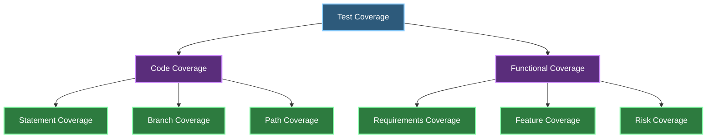

# Test Coverage in Software Testing 🎯

## 📋 Table of Contents
1. [Introduction to Test Coverage](#chapter-1-introduction-to-test-coverage)
2. [Coverage Fundamentals](#chapter-2-coverage-fundamentals)
3. [Coverage Techniques](#chapter-3-coverage-techniques)
4. [Coverage Metrics](#chapter-4-coverage-metrics)
5. [Tools and Implementation](#chapter-5-tools-and-implementation)
6. [Best Practices](#chapter-6-best-practices)

## Chapter 1: Introduction to Test Coverage 🚀
<details>
<summary>Click to expand</summary>

### 1.1 What is Test Coverage? 🤔

Test coverage is a metric that measures how much of your software is tested. It helps determine whether your test cases adequately cover the application code and functionality.



#### Key Aspects:

- **📊 Measurement**: 
  - Percentage of code executed
  - Requirements covered
  - Scenarios tested

- **🎯 Objectives**: 
  - Identify untested code
  - Ensure comprehensive testing
  - Improve test quality

### 1.2 Why is Test Coverage Important? 💡

#### Benefits:

| Aspect | Benefit | Example |
|--------|---------|---------|
| **Quality** ✨ | Better defect detection | Finding edge cases |
| **Confidence** 🛡️ | Reliable releases | Validated functionality |
| **Efficiency** ⚡ | Optimized testing | Focused test efforts |
| **Maintenance** 🔧 | Easier updates | Impact analysis |

</details>

## Chapter 2: Coverage Fundamentals 🔍
<details>
<summary>Click to expand</summary>

### 2.1 Types of Coverage 📚

#### 2.1.1 Code Coverage 💻

- **Statement Coverage**
  - Measures executed code lines
  - Basic coverage metric
  - Easy to understand and implement

- **Branch Coverage**
  - Tests decision points
  - Covers all possible paths
  - More thorough than statement coverage

#### 2.1.2 Functional Coverage 🎯

- **Requirements Coverage**
  - Maps tests to requirements
  - Ensures feature completeness
  - Validates business logic

- **Risk Coverage**
  - Focuses on critical areas
  - Prioritizes high-risk features
  - Risk-based testing approach

</details>

## Chapter 3: Coverage Techniques ⚙️
<details>
<summary>Click to expand</summary>

### 3.1 Statement Coverage 📝

#### Characteristics:
- Tests each line of code
- Basic coverage metric
- Foundation for other techniques

#### Implementation:
```python
def example_function(x):
    if x > 0:           # Statement 1
        return True     # Statement 2
    return False        # Statement 3
```

### 3.2 Branch Coverage 🌿

#### Characteristics:
- Tests all decision paths
- More thorough than statement coverage
- Includes conditional logic

#### Example:
```python
def complex_function(a, b):
    if a > 0:          # Branch 1
        if b > 0:      # Branch 2
            return "A"  # Branch 3
        return "B"      # Branch 4
    return "C"          # Branch 5
```

### 3.3 Path Coverage 🛣️

#### Characteristics:
- Tests all possible paths
- Most comprehensive
- Resource-intensive

### 3.4 Condition Coverage 🔄

#### Characteristics:
- Tests boolean conditions
- Covers multiple conditions
- Detailed logical testing

</details>

## Chapter 4: Coverage Metrics 📊
<details>
<summary>Click to expand</summary>

### 4.1 Measuring Coverage

#### 4.1.1 Code Coverage Metrics
```
Coverage % = (Covered Items / Total Items) × 100
```

| Metric | Formula | Target |
|--------|---------|--------|
| Statement | Lines Executed / Total Lines | 80-90% |
| Branch | Branches Covered / Total Branches | 70-80% |
| Path | Paths Tested / Total Paths | 60-70% |

#### 4.1.2 Functional Coverage Metrics

- **Requirements Coverage**
  - Tested Requirements / Total Requirements
  - Priority-based coverage
  - Risk-weighted metrics

- **Feature Coverage**
  - Tested Features / Total Features
  - User story coverage
  - Acceptance criteria coverage

</details>

## Chapter 5: Tools and Implementation 🛠️
<details>
<summary>Click to expand</summary>

### 5.1 Coverage Tools

#### 5.1.1 Code Coverage Tools
- JaCoCo (Java)
- Istanbul (JavaScript)
- Coverage.py (Python)
- Coverlet (.NET)

#### 5.1.2 Test Management Tools
- TestRail
- qTest
- Zephyr
- TestLink

### 5.2 Implementation Strategy

1. **Tool Selection** 🔨
   - Choose appropriate tools
   - Consider integration needs
   - Evaluate reporting capabilities

2. **Coverage Goals** 🎯
   - Set realistic targets
   - Define priorities
   - Establish metrics

3. **Implementation Steps** 📋
   - Configure tools
   - Integrate with CI/CD
   - Set up reporting

</details>

## Chapter 6: Best Practices 💡
<details>
<summary>Click to expand</summary>

### 6.1 Coverage Guidelines

1. **Balanced Approach** ⚖️
   - Don't focus solely on percentages
   - Consider business value
   - Balance effort and coverage

2. **Priority-Based Coverage** 🎯
   - Focus on critical paths
   - Risk-based testing
   - Business-critical features

3. **Continuous Monitoring** 📊
   - Regular coverage reviews
   - Trend analysis
   - Coverage maintenance

4. **Documentation** 📝
   - Coverage reports
   - Test mapping
   - Coverage gaps

### 6.2 Common Pitfalls ⚠️

1. **Coverage Obsession**
   - Focusing only on numbers
   - Ignoring quality
   - Missing critical scenarios

2. **Incomplete Coverage**
   - Missing edge cases
   - Overlooking error paths
   - Insufficient validation

3. **Poor Maintenance**
   - Outdated tests
   - Coverage decay
   - Technical debt

</details>

## Notes
- Coverage is a guide, not a guarantee
- Balance coverage with other quality metrics
- Regular review and updates are essential
- Consider both code and functional coverage
