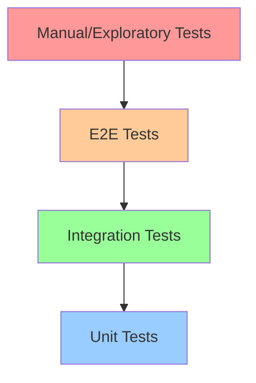

# Testing Pyramid in Software Development 🔺

## 📋 Table of Contents
1. [Introduction to Testing Pyramid](#chapter-1-introduction-to-testing-pyramid)
2. [Pyramid Fundamentals](#chapter-2-pyramid-fundamentals)
3. [Testing Layers](#chapter-3-testing-layers)
4. [Test Automation Benefits](#chapter-4-test-automation-benefits)
5. [Implementation Strategies](#chapter-5-implementation-strategies)
6. [Best Practices](#chapter-6-best-practices)

## Chapter 1: Introduction to Testing Pyramid 🚀

Click to expand

### 1.1 What is the Testing Pyramid? 🤔

The Testing Pyramid is a framework introduced by Mike Cohn in his book "Succeeding With Agile Software" that illustrates the ideal distribution of different types of tests in an automated testing strategy.

#### Key Characteristics:

- **📊 Layered Structure**: 
  - Different types of tests arranged in layers
  - Each layer serves a specific testing purpose
  - Width represents the quantity of tests

- **🎯 Test Distribution**: 
  - More tests at the bottom (Unit Tests)
  - Fewer tests at the top (UI/E2E Tests)
  - Balanced middle layer (Integration Tests)

### 1.2 Why Use the Testing Pyramid? 💡

#### Benefits:

| Aspect | Benefit | Example |
|--------|---------|---------|
| **Speed** ⚡ | Faster feedback cycle | Unit tests run in milliseconds |
| **Cost** 💰 | Lower maintenance costs | Fewer complex E2E tests |
| **Reliability** 🎯 | More stable test suite | Less flaky tests |
| **Coverage** 🔍 | Comprehensive testing | Multiple testing perspectives |

## Chapter 2: Pyramid Fundamentals 🔍

Click to expand

### 2.1 Core Principles 📚

#### 2.1.1 Test Granularity 🎯

- **Bottom Layer** ⚡
  - Most granular tests
  - Fastest execution
  - Highest quantity

- **Middle Layer** 🔄
  - Medium granularity
  - Moderate execution time
  - Balanced quantity

- **Top Layer** 🔝
  - Least granular tests
  - Slowest execution
  - Lowest quantity

#### 2.1.2 Automation Levels 🤖

| Layer | Automation Level | Focus |
|-------|-----------------|-------|
| Unit | High | Individual components |
| Integration | Medium | Component interactions |
| E2E | Low | Full system workflows |

## Chapter 3: Testing Layers ⚙️

Click to expand

### 3.1 Unit Tests (Base Layer) 📝

#### Characteristics:
- Tests individual functions/methods
- Fast execution
- Isolated from external dependencies
- High maintainability

#### Best Practices:
- Keep tests small and focused
- One assertion per test
- Use test doubles (mocks, stubs)
- Maintain high coverage

### 3.2 Integration Tests (Middle Layer) 🔄

#### Characteristics:
- Tests component interactions
- Moderate execution speed
- Limited external dependencies
- Medium complexity

#### Focus Areas:
- API testing
- Database interactions
- Service communications
- Module integration

### 3.3 E2E Tests (Top Layer) 🌐

#### Characteristics:
- Tests complete workflows
- Slower execution
- Real environment
- Higher maintenance

#### Key Points:
- Focus on critical paths
- Minimize test count
- Use stable selectors
- Handle asynchronous operations

### 3.4 Manual/Exploratory Tests (Cap) 🔍

#### Purpose:
- Find unexpected issues
- Validate user experience
- Explore edge cases
- Provide human insight

## Chapter 4: Test Automation Benefits 🎯

Click to expand

### 4.1 Key Advantages

#### 4.1.1 Time and Cost Savings 💰
- Faster test execution
- Reduced manual effort
- Early bug detection
- Continuous feedback

#### 4.1.2 Quality Improvements ✨
- Consistent test execution
- Comprehensive coverage
- Regression prevention
- Reliable results

#### 4.1.3 Development Efficiency 🚀
- Rapid feedback cycles
- Confidence in changes
- Automated regression testing
- Continuous integration support

## Chapter 5: Implementation Strategies 📈

Click to expand

### 5.1 Getting Started

#### 5.1.1 Bottom-Up Approach
1. Start with unit tests
2. Add integration tests
3. Implement E2E tests
4. Include manual testing

#### 5.1.2 Test Distribution
- 70% Unit tests
- 20% Integration tests
- 10% E2E tests
- Manual testing as needed

### 5.2 Tool Selection

| Layer | Tool Types | Examples |
|-------|------------|----------|
| Unit | Test frameworks | JUnit, NUnit |
| Integration | API testing tools | Postman, REST Assured |
| E2E | UI testing tools | Selenium, Cypress |

## Chapter 6: Best Practices 💡

Click to expand

### 6.1 General Guidelines

1. **Follow the Pyramid Shape** 📊
   - More unit tests
   - Fewer E2E tests
   - Balance integration tests

2. **Test Independence** 🔄
   - Avoid test dependencies
   - Maintain test isolation
   - Clean test data

3. **Maintenance Strategy** 🔧
   - Regular test reviews
   - Remove flaky tests
   - Update test documentation

4. **Continuous Integration** 🔄
   - Automate test execution
   - Monitor test results
   - Track test coverage

### 6.2 Common Pitfalls to Avoid ⚠️

1. **Ice Cream Cone Anti-pattern**
   - Too many E2E tests
   - Few unit tests
   - High maintenance cost

2. **Flaky Tests**
   - Unreliable results
   - Time-dependent tests
   - External dependencies

3. **Poor Test Design**
   - Complex setup
   - Multiple assertions
   - Unclear purpose

## Notes
- The Testing Pyramid is a guideline, not a strict rule
- Adapt the pyramid based on project needs
- Focus on test quality over quantity
- Regular maintenance is crucial for long-term success
