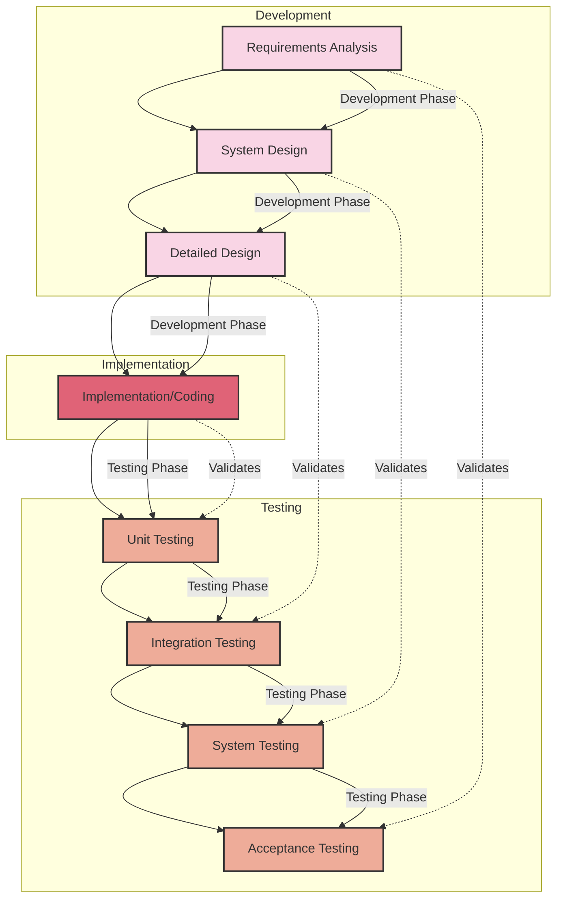

# V-Model in Software Development and Testing 🔄

## 📋 Table of Contents
1. [Introduction to V-Model](#chapter-1-introduction-to-v-model)
2. [V-Model Fundamentals](#chapter-2-v-model-fundamentals)
3. [Development Phases](#chapter-3-development-phases)
4. [Testing Phases](#chapter-4-testing-phases)
5. [V-Model vs Other Methodologies](#chapter-5-v-model-vs-other-methodologies)
6. [Best Practices and Implementation](#chapter-6-best-practices-and-implementation)

## Chapter 1: Introduction to V-Model 🚀

Click to expand

### 1.1 What is the V-Model? 🤔

The V-Model is a software development and testing methodology that represents a systematic approach to project lifecycle. It is an extension of the waterfall model but emphasizes the parallel relationship between development and testing phases.

#### Key Characteristics:

- **📈 Sequential Process**: 
  - Follows a structured, step-by-step approach
  - Each development phase has a corresponding testing phase

- **🔄 Verification & Validation**: 
  - Left side represents verification phases
  - Right side represents validation phases
  - Both sides mirror each other forming a 'V' shape

- **🎯 Traceability**: 
  - Clear mapping between development and testing activities
  - Each development phase links to a specific testing phase

### 1.2 Why Use the V-Model? 💡

#### Benefits:

| Aspect | Benefit | Example |
|--------|---------|---------|
| **Structure** 📋 | Clear project phases | Well-defined transitions between stages |
| **Quality** ✨ | Early defect detection | Testing planned in parallel with development |
| **Validation** ✅ | Comprehensive testing | Each development phase has corresponding tests |
| **Traceability** 🔍 | Requirements tracking | Clear links between requirements and tests |

## Chapter 2: V-Model Fundamentals 🔍

Click to expand

### 2.1 Core Principles 📚

#### 2.1.1 Verification vs Validation 🎯

- **Verification** ✅
  - Ensures we are building the product right
  - Focuses on specifications and standards
  - Example: Code reviews, static analysis

- **Validation** 🎯
  - Ensures we are building the right product
  - Focuses on user requirements and expectations
  - Example: User acceptance testing

#### 2.1.2 Parallel Development and Testing 🔄

Each development phase has a corresponding testing phase:

| Development Phase | Testing Phase |
|------------------|---------------|
| Requirements | Acceptance Testing |
| System Design | System Testing |
| Architecture Design | Integration Testing |
| Module Design | Unit Testing |

## Chapter 3: Development Phases ⚙️

Click to expand

### 3.1 Left Side of the V 📝

#### 3.1.1 Requirements Analysis 📋
- Gathering user requirements
- Documenting system specifications
- Defining acceptance criteria

#### 3.1.2 System Design 🏗️
- High-level system architecture
- System components and interfaces
- Overall system structure

#### 3.1.3 Architecture Design 🔨
- Detailed system architecture
- Component interactions
- Technical specifications

#### 3.1.4 Module Design 🛠️
- Detailed component design
- Unit specifications
- Implementation guidelines

## Chapter 4: Testing Phases 🧪

Click to expand

### 4.1 Right Side of the V 📝

#### 4.1.1 Unit Testing ⚡
- Testing individual components
- Verifying component functionality
- Isolated testing environment

#### 4.1.2 Integration Testing 🔄
- Testing component interactions
- Interface testing
- System integration verification

#### 4.1.3 System Testing 🔍
- End-to-end system testing
- Performance testing
- Security testing

#### 4.1.4 Acceptance Testing ✅
- User acceptance testing
- Business requirement validation
- Production environment testing

## Chapter 5: V-Model vs Other Methodologies 📊

Click to expand

### 5.1 Comparison with Other Models

#### 5.1.1 V-Model vs Waterfall 🌊

| Aspect | V-Model | Waterfall |
|--------|---------|-----------|
| Testing | Parallel with development | Sequential after development |
| Flexibility | Moderate | Low |
| Risk Management | Early detection | Late detection |
| Cost of Changes | Medium | High |

#### 5.1.2 V-Model vs Agile 🔄

| Aspect | V-Model | Agile |
|--------|---------|-------|
| Structure | Highly structured | Flexible |
| Iterations | Linear process | Iterative process |
| Changes | Formal change process | Embraces changes |
| Documentation | Comprehensive | Minimal |

## Chapter 6: Best Practices and Implementation 💡

Click to expand

### 6.1 When to Use V-Model

#### Best Suited For:
- Critical systems
- Safety-critical applications
- Regulated industries
- Well-defined, stable requirements

#### Not Recommended For:
- Rapidly changing requirements
- Quick delivery needs
- Limited resources
- Experimental projects

### 6.2 Implementation Tips 🎯

1. **Clear Requirements** 📋
   - Document thoroughly
   - Get stakeholder sign-off
   - Maintain traceability

2. **Test Planning** ✅
   - Plan tests early
   - Map to requirements
   - Define test criteria

3. **Quality Gates** 🚪
   - Define phase completion criteria
   - Review deliverables
   - Document decisions

4. **Documentation** 📝
   - Maintain comprehensive documentation
   - Update as changes occur
   - Keep traceability matrix

## Notes
- The V-Model is particularly effective for projects requiring high reliability
- Early test planning helps in better requirement understanding
- Each phase must be completed before moving to the next
- Changes can be expensive if introduced late in the cycle
